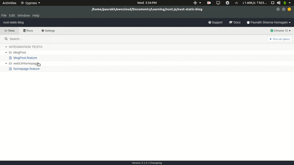

# nuxt-static-blog

Simple static nuxt blog

## Build Setup

``` bash
# install dependencies
$ yarn install

# serve with hot reload at localhost:3000
$ yarn run dev

# build for production and launch server
$ yarn run build
$ yarn start

# generate static project
$ yarn run generate
```

For detailed explanation on how things work, checkout [Nuxt.js docs](https://nuxtjs.org).


# Run cypress test

1) Make sure your server is running

2) Run
```bash
yarn cypress:open
```
3) Wait for cypress window to open

4) Click on the test you want to run

And see the magic happen 🤓


